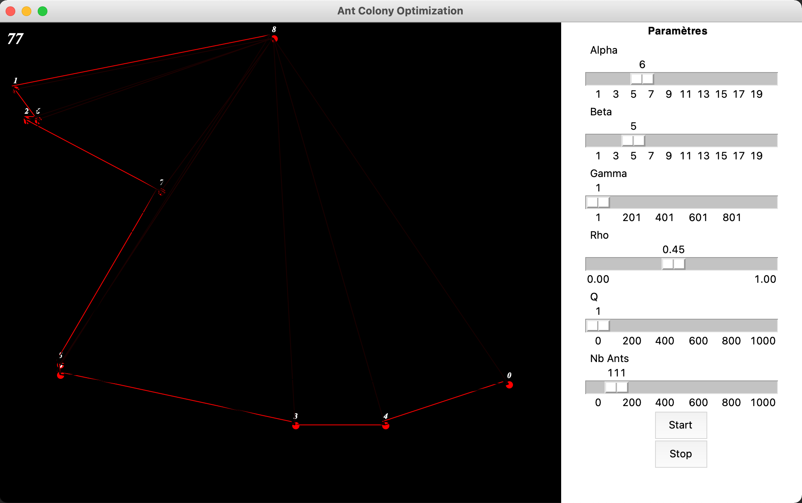

# Optimisation par Colonies de Fournis (ACO) 
_Auteur:_ [Gabriel Nativel-Fontaine](mailto:gnativ910e@ensc.fr)

Ce dépôt contient une application python présentant une visualisation graphique (TKinter) de l'algorithme d'optimisation de colonie de fourmis.
Il a été réalisé dans le cadre du module **Intelligence distribuée** du parcours **Intelligence Artificielle** inscrit dans la 3ème année du cursus d'ingénieur au sein de l'[Ecole Nationale Supérieure de Cognitique](http://www.ensc.fr).

## Utilisation
Pour lancer l'application avec 10 villes dans la simulation
```shell
$ git clone https://github.com/Gab1i/tp-intelligence-distribuee
$ cd tp-intelligence-distribuee
$ python3 main.py -n 10
```

<p align="center">
    
</p>


Le panneau de droite permet de sélectionner les paramètres de la simulation. Une fois les paramètres choisis, appuyez sur Start pour lancer la simulation.

- Le bouton pause permet de mettre en pause la simulation, cliquez sur Start pour la relancer
- Le bouton stop coupe complètement la simulation. Les paramètres sélectionnés ne seront pris en compte qu'**après avoir stoppé la simulation** en cliquant sur Start. 


## Problème alternatif
Il est possible de lancer l'application avec un problème légèrement différent dans lequel les points sont des villes de Frances avec leurs positions en latitude et longitude.
La distance calculée entre les points est calculée à l'aide de la formule de Haversine.

Pour lancer cette version du code:
```shell
$ python3 main.py -cities
```

<p align="center">
    
</p>
